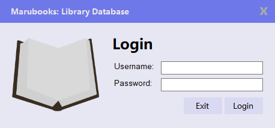

# Marubooks2.0
A Book Library Database System Using Visual Studio 2019

## Screenshot

## Current features
- A login page
- An admin database 
- Flat design

## Features to add 
- Membership form
- Database of books (data grid view)
- Issue and Return book
- Edit database info
  
## Built with
- Visual Studio 2019
- VBNET
- MySQL (XAMPP)

## Things to work on

- MySQL syntax on VB.net
- Other queries
- VB.NET Modules, Classes
- String manipulation
- Design practices in Visual Studio

